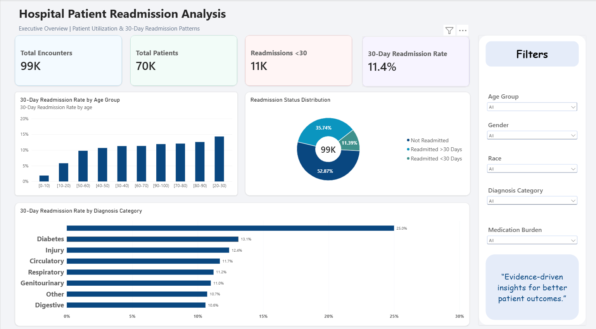
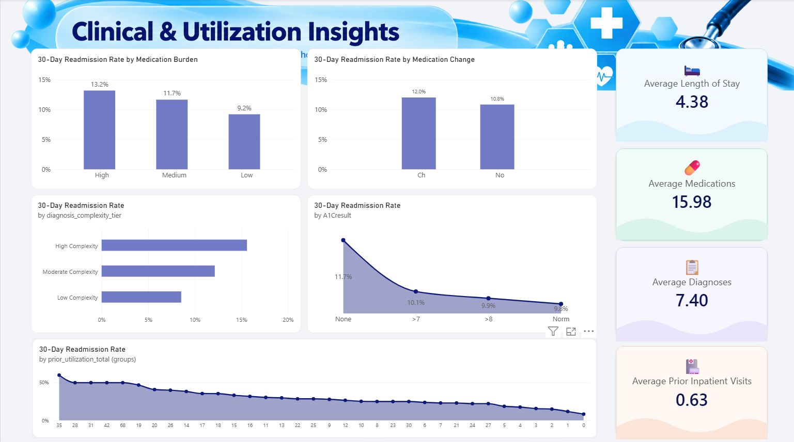

<p align="center">
  
</p>

# 🏥 Hospital Patient Readmission Analysis

A data analytics project examining **99,000+ diabetic patient encounters** from 130 U.S. hospitals (1999–2008) to identify patterns associated with 30-day readmissions, using a full pipeline from raw MySQL data through Python EDA and statistical testing to an interactive Power BI dashboard.

---

## 🔍 Problem Statement

Hospital readmissions within 30 days of discharge signal unresolved patient needs, strain hospital resources, and in many systems carry financial penalties. For a diabetic population — with complex medication regimens, multiple comorbidities, and frequent prior healthcare interactions — tracking early return risk is especially difficult. The raw dataset, a single CSV from a multi-hospital research database, came with missing values encoded as `?`, no standardized outcome coding, and no ready-made analytical features. This project builds a clean, structured pipeline to surface associations across demographics, clinical complexity, medication burden, and prior utilization — giving a factual foundation for understanding who is readmitted and under what conditions.

---

## 🏗️ Data Architecture

```
Raw CSV (diabetic_data.csv)
        ↓
MySQL — Raw Table → Cleaning → Feature Engineering → Analytical View
          (hospital_readmission_analysis.sql)
        ↓
Python — Validation, EDA, Statistical Testing, CSV Export
        ↓
Power BI — Data Model, DAX Measures, Interactive Dashboard
```

### 🥉 Bronze — Raw Data
Source CSV files loaded into MySQL as-is (`diabetic_data_raw`), no transformations applied.

### 🥈 Silver — Cleaned & Engineered
- `?` sentinel values converted to `NULL` across 7 columns
- Duplicate row removal while preserving legitimate multi-visit patients
- Expired and hospice encounters removed — they cannot be readmitted and would skew the denominator
- Engineered features: `is_readmitted_30`, `age_midpoint`, `medication_burden_tier`, `diagnosis_complexity_tier`, `diagnosis_category`

### 🥇 Gold — Analytics-Ready
- Denormalized view `vw_readmission_analysis` — LEFT JOINed with lookup tables for discharge disposition, admission type, and admission source
- Exported to `readmission_analysis_powerbi.csv` for Power BI consumption

---

## 📊 Dataset

**Source:** [UCI — Diabetes 130-US Hospitals (1999–2008)](https://archive.ics.uci.edu/ml/datasets/Diabetes+130-US+hospitals+for+years+1999-2008)

Each row = one hospital encounter. The same patient may appear multiple times across different admissions — **99,343 encounters** from **69,990 unique patients** after cleaning and filtering.

**Target variable — `readmitted`:** `<30` (within 30 days) · `>30` (after 30 days) · `NO` (not readmitted)

**Key limitations:** Covers 1999–2008; `weight` (~97% missing) and `payer_code` (~40% missing) excluded; A1C not tested in ~83% of encounters.

---

## 🛠️ Tools

**MySQL 8.0** — data hosting, cleaning, feature engineering, EDA queries  
**Python 3.12** — pandas, scipy, seaborn, SQLAlchemy for EDA and statistical testing  
**Power BI Desktop** — data model, DAX measures, interactive dashboard  
**Jupyter Notebook** — Python analysis workflow · **Git / GitHub** — version control

---

## ⚙️ ETL Pipeline

### MySQL (`sql/hospital_readmission_analysis.sql`)

The SQL script is organized into 13 sections covering database setup → raw inspection → data quality checks → `?` → `NULL` conversion → deduplication → discharge filtering → feature engineering → mapping tables → 15+ EDA breakdowns → advanced SQL (`NTILE`, `RANK OVER PARTITION`, CTEs) → business questions → the final analytical view `vw_readmission_analysis` → 7 validation checks and performance indexes.

### Python (`notebooks/hospital_readmission_eda.ipynb`)

Connects to MySQL via SQLAlchemy, validates data integrity (0 duplicate rows, 0 duplicate encounter IDs), confirms only diagnosis columns carry minor nulls post-cleaning, adds Python-side features (`prior_utilization_total`, `utilization_tier`, `analytical_risk_score`), produces grouped EDA summaries across 9 dimensions, runs statistical tests, and exports the final CSV as `readmission_analysis_gold.csv` for Power BI.

**Statistical tests run:**
- Chi-Square: Medication Burden vs. Readmission → p = **2.66e-43**
- Chi-Square: Diagnosis Category vs. Readmission → p = **4.77e-10**
- Mann-Whitney U: Length of Stay vs. Readmission → p = **1.54e-62**

**Overall 30-day readmission rate: 11.39% (95% CI: 11.19%–11.59%)**

---

## 🔧 Feature Engineering

- **`is_readmitted_30`** — binary target: 1 if readmitted <30 days, 0 otherwise
- **`age_midpoint`** — numeric midpoint of each age bracket (e.g., `[60-70)` → 65) for quantitative analysis
- **`medication_burden_tier`** — Low (≤10 meds), Medium (11–20), High (>20)
- **`diagnosis_complexity_tier`** — Low (≤5 diagnoses), Moderate (6–9), High (≥10)
- **`diagnosis_category`** — ICD-9 primary code mapped to: Diabetes · Circulatory · Respiratory · Digestive · Genitourinary · Injury · Other
- **`prior_utilization_total`** *(Python)* — sum of inpatient + emergency + outpatient prior visits
- **`utilization_tier`** *(Python)* — None (0 visits), Low (1–2), High (3+)
- **`analytical_risk_score`** *(Python)* — 0–3 composite score; +1 each for High medication burden, High complexity, High utilization *(not a clinical model — exploratory only)*

---

## 📈 Power BI Dashboard

### Page 1 — Executive Overview



**KPI Cards:** Total Encounters: 99K · Total Patients: 70K · Readmissions <30: 11K · 30-Day Rate: **11.4%**

**Charts:**
- 30-Day Readmission Rate by Age Group — rate trends upward with age; [0-10) lowest, [20-30) and [80-90) highest
- Readmission Status Distribution — Not Readmitted 52.87% · Readmitted >30 Days 35.74% · Readmitted <30 Days 11.39%
- 30-Day Readmission Rate by Diagnosis Category — Diabetes 13.1% (highest), Digestive 10.6% (lowest)

**Slicers:** Age Group · Gender · Race · Diagnosis Category · Medication Burden

---

### Page 2 — Clinical & Utilization Insights



**KPI Cards:** Avg. Length of Stay: 4.38 days · Avg. Medications: 15.98 · Avg. Diagnoses: 7.40 · Avg. Prior Inpatient Visits: 0.63

**Charts:**
- Readmission Rate by Medication Burden — High: 13.2% · Medium: 11.7% · Low: 9.2%
- Readmission Rate by Medication Change — Changed: 12.0% · Not Changed: 10.8%
- Readmission Rate by Diagnosis Complexity — High: 15.6% · Moderate: 12.1% · Low: 8.5%
- Readmission Rate by A1C Result — None (not tested): 11.7% · >7: 10.1% · >8: 9.9% · Norm: 9.8%
- Readmission Rate by Prior Utilization Total — rate drops sharply as prior utilization decreases from high to none

**Open the Power BI file:** [reports/readmission.pbix](./reports/readmission.pbix)

---

## 🔑 Key Findings

> All findings are **associations observed in this dataset** — not causal relationships.

**Overall:** 11.39% of encounters resulted in 30-day readmission — 11,314 out of 99,343.

**Medication burden** shows a clear gradient: High burden encounters have a 13.2% readmission rate vs. 9.2% for Low. Chi-Square p = 2.66e-43 — not a chance difference.

**Diagnosis complexity** follows the same pattern: High Complexity 15.6% vs. Low Complexity 8.5%, though the High group is very small (109 encounters) and should be read cautiously.

**Diagnosis category** matters too (p = 4.77e-10). Diabetes as the primary diagnosis had the highest rate at 13.1%, followed by Injury at 12.4%. Digestive conditions sat lowest at 10.6%.

**Prior healthcare utilization** showed the sharpest spread: patients with high prior utilization (3+ visits across inpatient, emergency, outpatient) had a 19.4% readmission rate — more than double the 8.3% for those with no prior visits. This is likely a proxy for ongoing clinical complexity rather than a cause of readmission.

**A1C testing** revealed an interesting pattern: patients who weren't tested at all had the highest observed rate (11.7%), while those with a normal result had the lowest (9.8%). Given that A1C was absent in 83% of encounters, this suggests testing itself may coincide with more active glycemic management.

**Medication changes and length of stay** were also statistically distinguishable between groups — encounters with medication changes showed a 12.0% rate vs. 10.8% without, and length-of-stay distributions differed significantly (Mann-Whitney U p = 1.54e-62).

---

## 💡 Recommendations

These are analytical recommendations based on observed patterns in this dataset. They are intended to guide further investigation, not to serve as clinical guidance.

**1. Investigate high-prior-utilization patients more closely.**
The jump from 8.3% (no prior visits) to 19.4% (high prior utilization) is the largest spread in the analysis. Patients with 3+ prior encounters in the past year may benefit from targeted care coordination or discharge planning review. This segment is worth examining at the encounter level to understand what's driving repeat returns.

**2. Take a closer look at diabetic primary diagnoses.**
Encounters where diabetes was the primary ICD-9 code had the highest readmission rate across all categories (13.1%). Combined with the A1C finding — where patients not tested for A1C had higher readmission rates — this points toward glycemic management as an area worth reviewing more systematically.

**3. Expand A1C testing documentation.**
A1C was not recorded in 83% of encounters. That's not necessarily wrong clinically, but it limits what can be analyzed. If A1C results were captured more consistently, it would become possible to compare outcomes across glycemic control levels with much higher confidence.

**4. Use the medication burden tier as a flag, not a verdict.**
High medication burden (>20 medications) correlated with higher readmission, but medications are a symptom of complexity, not a cause of readmission. The more useful question is: are high-burden patients getting appropriate discharge support, medication reconciliation, and follow-up scheduling? The data can surface the who; clinical teams need to investigate the why.

**5. Build on this analysis with a predictive layer.**
The engineered features in this project — particularly `medication_burden_tier`, `utilization_tier`, `diagnosis_complexity_tier`, and `diagnosis_category` — are natural candidates for a classification model targeting `is_readmitted_30`. This analysis establishes the associations; a follow-up modeling project could assess whether these features can meaningfully predict individual-level risk.

---

## 📂 Repository Structure

```text
readmission_analysis/
│
├── data/
│   ├── raw_data/           # diabetic_data.csv, admission_codes_mapping.csv
│   └── cleaned_data/       # readmission_analysis_gold.csv
│
├── sql/
│   └── hospital_readmission_analysis.sql
│
├── notebooks/
│   └── hospital_readmission_eda.ipynb
│
├── charts/                 # EDA charts (7 PNG files)
│
├── reports/
│   ├── executive_overview.png
│   ├── utilization_insights.png
│   ├── hospital_readmission_dashboard.pbix
│   └── README.md
│
└── README.md
```

---

## 🚀 Getting Started

**Prerequisites:** MySQL 8.0+ · Python 3.12+ · Power BI Desktop

1. Load `diabetic_data.csv` into MySQL as `diabetic_data_raw` in a database called `hospital_readmissions`
2. Run `sql/hospital_readmission_analysis.sql` sequentially — cleans, engineers, and creates `vw_readmission_analysis`
3. Open `notebooks/hospital_readmission_eda.ipynb`, update DB credentials in Cell 1, run all cells
4. Open `reports/hospital_readmission_dashboard.pbix` in Power BI Desktop


## 🛠️ Tech Stack

<p align="center">
  
</p>

---

## 🛡️ License

This project is licensed under the [MIT License](LICENSE).

---


*Dataset: Strack, B. et al. (2014). Impact of HbA1c Measurement on Hospital Readmission Rates. BioMed Research International.*
